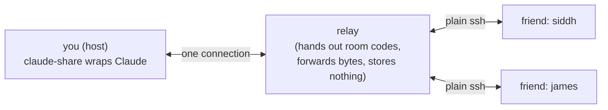

# claude-share

**Make your Claude Code session multiplayer.** You run one command. Friends join from any terminal with plain `ssh` — nothing to install. Everyone prompts the same Claude together: shared draft lines, a visible queue, live roles.

Think **screen-share, but they can type too** — like a Google Doc that happens to be your terminal and your Claude.



The trick: a terminal only draws bytes and reports keypresses, and `ssh` already carries exactly those. So guests need **zero install** — they watch your screen and mail keystrokes back. The relay is dumb on purpose; all the smarts live on your machine.

---

## Try it on your own laptop (localhost dev)

You'll open **three terminals**: a relay, a host, and a guest.

**0. Install once**

```bash
npm install
```

**1. Start a local relay** (terminal 1)

```bash
node -e '
  import("./packages/relay/server.js").then(async ({ startRelay }) => {
    const { utils } = (await import("ssh2")).default;
    const relay = await startRelay({
      port: 2222,
      hostName: "dev",
      hostKey: utils.generateKeyPairSync("ed25519").private,
    });
    console.log("relay listening on port", relay.port);
  });
'
```

**2. Become the host** (terminal 2) — this wraps Claude and prints your room code:

```bash
node packages/cli/bin/claude-share.js --relay ssh://127.0.0.1:2222
```

Watch the bottom band. It shows an invite like `ssh brave-otter@127.0.0.1` — `brave-otter` is your **room code**.

**3. Join as a guest** (terminal 3) — the room code is the ssh *username*:

```bash
ssh -p 2222 -o StrictHostKeyChecking=no -o UserKnownHostsFile=/dev/null brave-otter@127.0.0.1
```

Pick a name, and you'll knock. Back in the host terminal you'll see `🚪 "name" knocking … admit? (y/n)` — press **y**. The guest now sees your Claude, live.

> No `claude` installed? Point the host at any command with `--cmd`, e.g. a stub. (Hook-based state detection only turns on for the real `claude`.)

---

## Who can do what

Roles are set by the host with `/role @name driver` and shown to the whole room.

| Role | Sees the session | Types drafts | Answers permission asks · flips modes |
|---|---|---|---|
| 👁 viewer | ✅ | ❌ | ❌ |
| ✎ prompter *(default)* | ✅ | ✅ | ❌ |
| ⚑ driver | ✅ | ✅ | ✅ |
| ★ host | ✅ | ✅ | ✅ |

Host commands: `/role @name <role>` · `/kick @name` · `/pause` / `/resume` · `/recap` · `/end`.

## Composing together

Each draft is its own author-tagged box, and everyone's live cursor shows up in it — two named cursors writing one prompt together. **Enter** sends only the box your cursor is in; move your cursor into someone else's box to co-write it. **Ctrl+N** starts a fresh draft of your own (the "+ start a new draft" affordance) — handy when your cursor is parked in a box someone else is writing. Standard editing keys work inside a draft (shift+enter for a newline, word-jump, kill-line, home/end).

When Claude is busy, sent drafts wait in a numbered queue. Manage yours with `/queue del <n>` and `/queue edit <n> <text>` — you can edit or delete your own item; a driver or the host can delete any.

## One thing to really understand

**A guest prompt is a real action.** It runs against your Claude — real edits, real commands. Admitting someone to type = trusting them to drive your machine under the current mode. The relay also *sees everything* on your screen (treat a room like a screen-share, not a vault). The host has `/pause` for sensitive moments and `/end` to close the room (optionally saving a `session.md` of who typed what).

## Running the tests

```bash
npm test
```

<details>
<summary>What's inside (architecture &amp; layout)</summary>

Three packages, plain ESM JavaScript, Node 22, no build step. Only two dependencies: `ssh2` and `node-pty`.

```
packages/shared/   protocol.js      — the host↔relay wire messages (JSON-lines)
packages/relay/    server.js        — the dumb ssh front door + room registry
                   rooms.js         — codes, TTL, cap, knock lockout
packages/cli/      bin/claude-share.js  — the host program (the "brain")
                   src/pty.js       — wraps Claude in a shortened PTY (leaves room for the band)
                   src/renderer.js  — paints the bottom band under Claude's TUI
                   src/hooks.js     — learns Claude's state from injected hooks (never screen-scrapes)
                   src/relay-client.js — the one outbound connection to the relay
                   src/brain/*.js   — drafts, queue, roles, gate, commands, join card, log
test/e2e.test.js   — the whole system on localhost: host + 2 guests, end to end
```

**How the band works:** Claude gets a PTY a few rows shorter than your real terminal, so its cursor can never touch the reserved bottom rows — that's where claude-share paints draft boxes, the queue, and knocks. Redraws sync to Claude's own frame markers so nothing smears.

**How state is known:** claude-share injects Claude Code hooks (`UserPromptSubmit`, `Stop`, `Notification`, `PostToolUse`) that post to a local socket. That's how it knows Claude is busy, idle, or waiting on a permission ask — no guessing from pixels. If a signal is ever ambiguous, it fails closed: the queue won't drain and only the host answers.

**The relay stores nothing.** Room codes, roles, and the queue all live in the host process. Kill the relay and everyone reconnects with nothing lost; kill the host and the room is simply over.

</details>

**TL;DR:** `npm install`, start the relay, run `claude-share` as the host, and friends join with `ssh <room-code>@<relay>`. No install for them, roles keep you in control, and a guest's prompt really does drive your Claude — so admit people you trust.
