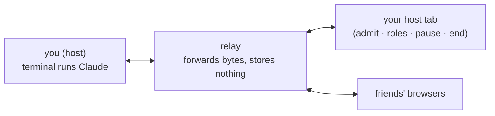

# claudecollab

**Make your Claude Code session multiplayer.** You run one command. Friends open a link — no install — and drive the same Claude with you: live cursors, shared drafts, a visible queue, roles.

Think **screen-share where they can type too**.

Your terminal stays plain Claude plus one status line. Everything multiplayer happens in the browser.

## Roles

| Role | See | Type · answer asks · slash/bash | Admit · kick · pause · end |
|---|---|---|---|
| 👁 viewer | ✅ | ❌ | ❌ |
| ✎ prompter *(default)* | ✅ | ✅ | ❌ |
| ★ host | ✅ | ✅ | ✅ |

