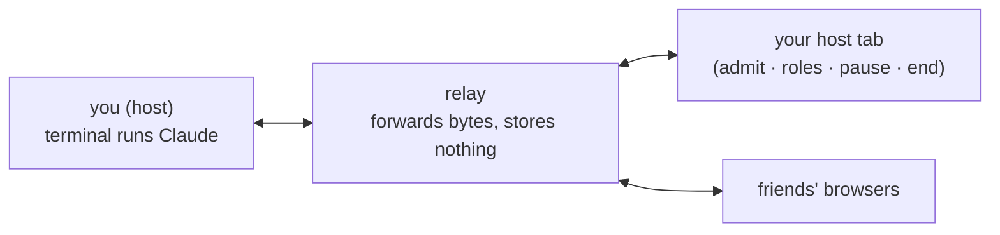

# claude-share

**Make your Claude Code session multiplayer.** You run one command. Friends open a link — no install — and drive the same Claude with you: live cursors, shared drafts, a visible queue, roles.

Think **screen-share where they can type too**.



Your terminal stays plain Claude plus one status line. Everything multiplayer happens in the browser.

## Run it locally

```bash
npm install
```

**Terminal 1 — relay:**

```bash
node packages/relay/bin/serve.js
```

**Terminal 2 — host:**

```bash
node packages/cli/bin/claude-share.js --relay ssh://127.0.0.1:2222
```

Open the link from the status line — that's your host tab. The invite link is on your clipboard.

## Deploy the relay (permanent links)

```bash
fly launch --no-deploy      # keep the provided fly.toml
fly secrets set HOST_KEY="$(node packages/relay/bin/serve.js --make-key)"
fly secrets set ROOM_SECRET="$(openssl rand -hex 16)"
fly deploy
```

Then host with `--relay ssh://your-app.fly.dev:2222`. Links print your public https origin automatically.

Two protections kick in on a deployed relay:

- **Room secret** — with `ROOM_SECRET` set, only hosts that present it (`CLAUDE_SHARE_SECRET` env or `--secret`) can create rooms; strangers who find your relay can't. Guests are unaffected — they enter with a room link.
- **Identity pinning** — the CLI pins the relay's ssh key fingerprint on first connect (like ssh's `known_hosts`) and refuses to connect if it ever changes, so nobody can impersonate your relay. The relay prints its fingerprint at boot; pass it as `--fingerprint SHA256:…` to pin explicitly. Loopback relays are exempt (dev relays regenerate keys).

## Two links — don't mix them up

| Link | Who it's for |
|---|---|
| `…/room?host=abc` | **you only** — opening it grants the host seat |
| `…/room` | **share this** — friends land on the request-to-join flow |

The Invite button and your clipboard always hold the safe one.

## Roles

| Role | See | Type · answer asks · slash/bash | Admit · kick · pause · end |
|---|---|---|---|
| 👁 viewer | ✅ | ❌ | ❌ |
| ✎ prompter *(default)* | ✅ | ✅ | ❌ |
| ★ host | ✅ | ✅ | ✅ |

## How it feels

- The whole page is the terminal. Type with no draft open → keys go **straight into Claude** — menus, asks, everything.
- **+ draft** (or double-click) opens a floating glass box. Everyone's caret shows; Enter sends; Esc steps out; drag ⠿ to move, ◢ to resize, ✕ to delete.
- Sent while Claude is busy? It waits in the **queue** chip — edit or delete before it fires.
- Scroll the mirror like a real terminal. Scrolling is shared — one screen for everyone.
- Reloaded guests glide straight back in. Kicked guests are out for good.

## The one thing to really understand

A guest prompt **runs on your machine, as you**. Admitting someone = trusting them with your Claude under the current mode. The relay sees your screen — treat a room like a screen-share, not a vault. You have **Pause** and **End** (with an optional `session.md` receipt).

## Tests

```bash
npm test
```

<details>
<summary>Architecture</summary>

Three packages, plain ESM JavaScript, Node 22, no build step.

```
packages/shared/   protocol.js — host↔relay wire messages
packages/relay/    server.js (ssh door) · web.js (browser door) · public/ (client)
packages/cli/      bin/claude-share.js — the "brain": drafts, queue, roles, gate
test/              end-to-end: host + host tab + guest on localhost
```

- The CLI wraps Claude in a PTY one row short — the bottom row is the status line.
- State (busy/idle/ask) comes from injected Claude Code hooks, never screen-scraping. Ambiguity fails closed.
- The relay stores nothing: kill it and the host reconnects; kill the host and the room is over.

</details>

**TL;DR:** relay up → `claude-share` → open your link, share the invite. Guests need nothing. Roles keep control; prompts are real — admit people you trust.
