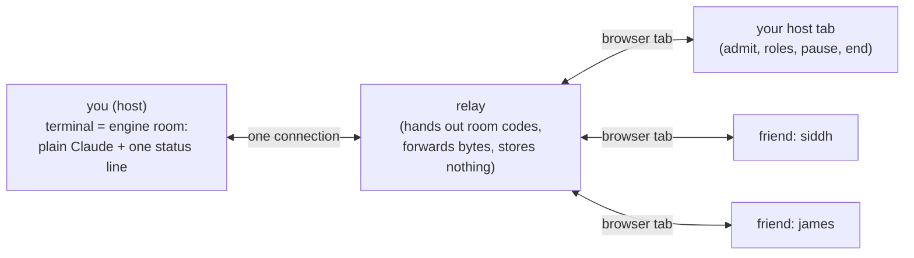

# claude-share

**Make your Claude Code session multiplayer.** You run one command. Friends open a link in their browser and prompt the same Claude with you — live cursors, shared draft lines, a visible queue, and roles that say who can do what.

Think **screen-share, but they can type too** — like a Google Doc that happens to be your terminal and your Claude.



Your terminal stays the **engine room**: plain, native Claude exactly like solo, plus one status line at the bottom (room code, who's here, Claude's state, and your room link). All the multiplayer — admitting people, co-writing prompts, roles, pause, end — happens in a **browser tab you open yourself**. Guests need **zero install**: they just open a link.

---

## Two links, and the difference really matters

When your room is ready, the status line shows **your** link and the invite is copied to your clipboard. They are **not the same link**:

| Link | Looks like | Who it's for |
|---|---|---|
| **your host link** | `…/brave-otter?host=abc123` | **you only.** Opening it makes you the host — you can admit, kick, set roles, pause, end. It stays on your status line. |
| **the invite link** | `…/brave-otter` | **share this one.** A friend who opens it lands on the normal request-to-join flow. This is what gets copied to your clipboard. |

> ⚠️ **Never paste your host link to a friend.** Anyone who opens a link with `?host=…` becomes a host of your room. Share the plain invite link (no `?host=`) — that's the one on your clipboard, and the "Copy invite link" button in your host tab always gives you the safe one.

---

## Try it on your own laptop (localhost dev)

You'll use **two terminals** and a **browser**.

**0. Install once**

```bash
npm install
```

**1. Start a local relay** (terminal 1) — with a browser door on port 8787:

```bash
node -e '
  import("./packages/relay/server.js").then(async ({ startRelay }) => {
    const fs = await import("node:fs");
    const os = await import("node:os");
    const keyPath = os.homedir() + "/.claude-share-dev-hostkey";
    // One identity for life: a fresh key per launch makes ssh scream
    // "REMOTE HOST IDENTIFICATION HAS CHANGED" at every guest after a restart.
    if (!fs.existsSync(keyPath)) {
      const { utils } = (await import("ssh2")).default;
      fs.writeFileSync(keyPath, utils.generateKeyPairSync("ed25519").private, { mode: 0o600 });
    }
    const relay = await startRelay({ port: 2222, webPort: 8787, hostName: "dev", hostKeyPath: keyPath });
    console.log("relay: ssh on", relay.port, "· browser on", relay.webPort);
  });
'
```

**2. Become the host** (terminal 2) — this wraps Claude and prints your room link:

```bash
node packages/cli/bin/claude-share.js --relay ssh://127.0.0.1:2222
```

Watch the bottom status line. It shows a link like `http://127.0.0.1:8787/brave-otter?host=…` — that's **your host link**. Open it in a browser: you're now in your host tab.

**3. Invite a friend** — the plain **invite link** (`http://127.0.0.1:8787/brave-otter`, no `?host=`) is on your clipboard, and the **Copy invite link** button in your host tab always hands you the safe one. Open it in another browser tab (or send it): pick a name, request to join, and **Admit** them from your host tab. They now see your Claude, live.

> No `claude` installed? Point the host at any command with `--cmd`, e.g. a stub. (Hook-based state detection only turns on for the real `claude`.)
>
> The old plain-`ssh` guest door still works (`ssh -p 2222 brave-otter@127.0.0.1`) as an uninvested side door, but the browser is where everything happens now.

---

## Who can do what

Roles are set by the host from the host tab (or `/role @name driver`) and shown to the whole room.

| Role | Sees the session | Types drafts | Answers permission asks · flips modes |
|---|---|---|---|
| 👁 viewer | ✅ | ❌ | ❌ |
| ✎ prompter *(default)* | ✅ | ✅ | ❌ |
| ⚑ driver | ✅ | ✅ | ✅ |
| ★ host | ✅ | ✅ | ✅ |

Host controls (buttons in your tab, or `/`-commands): set a role · kick · pause / resume · recap · end.

## Composing together

The whole page is the terminal. Drafts are small glass boxes **floating on top of it** — make one with the **+ draft** chip (or double-click an empty spot, and it spawns right there). Each draft is author-tagged, and everyone's live caret shows up in it — two named carets writing one prompt together. **Enter** sends the box your caret is in; click into someone else's box to co-write it; **Esc** steps out; drag the ⠿ bar to move it, the ◢ corner to resize, ✕ deletes. Standard editing keys work inside (shift+enter newline, word-jump, kill-line, ⌘⌫, drag-select).

Anyone who can prompt, with no draft focused, types **straight into Claude** — arrows and Enter drive Claude's own menus (`/model`) exactly like sitting at the terminal. The ⌨ chip glows while your keys go raw. Permission asks and mode flips stay **driver/host** territory: a prompter's typing pauses while an ask is pending (Esc still interrupts).

When Claude is busy, sent drafts wait in an attributed queue — the **queue n** chip in the header opens it (edit/delete your own; a driver or the host can delete any).

## One thing to really understand

**A guest prompt is a real action.** It runs against your Claude — real edits, real commands. Admitting someone to type = trusting them to drive your machine under the current mode. The relay also *sees everything* on your screen (treat a room like a screen-share, not a vault). You have **Pause** for sensitive moments and **End** to close the room (optionally saving a `session.md` of who typed what).

## Running the tests

```bash
npm test
```

<details>
<summary>What's inside (architecture &amp; layout)</summary>

Three packages, plain ESM JavaScript, Node 22, no build step. Dependencies: `ssh2` + `node-pty` (the host wraps Claude in a PTY), `ws` (the relay's browser sockets), and a vendored `@xterm/xterm` for the browser mirror.

```
packages/shared/   protocol.js      — the host↔relay wire messages (JSON-lines)
packages/relay/    server.js        — the dumb ssh front door + room registry
                   web.js           — the browser door (http + websockets)
                   rooms.js         — codes, TTL, cap, knock lockout
                   names.js         — the printable-ASCII name filter both doors run
                   public/          — the browser client (no build step)
packages/cli/      bin/claude-share.js  — the host program (the "brain")
                   src/pty.js       — wraps Claude in a shortened PTY (leaves room for the status line)
                   src/renderer.js  — paints the one status line under Claude's TUI
                   src/invite.js    — the host-link / invite-link split + the room-ready toast
                   src/hooks.js     — learns Claude's state from injected hooks (never screen-scrapes)
                   src/relay-client.js — the one outbound connection to the relay
                   src/brain/*.js   — drafts, queue, roles, gate, commands, join card, log
test/e2e.test.js   — the whole system on localhost: host + host tab + ssh guest, end to end
test/roster-id.test.js — the host tab targets duplicate-named guests by id, end to end
```

**The terminal is the engine room.** Claude gets a PTY one row shorter than your real terminal, so its cursor can never touch the bottom row — that's where claude-share paints its single status line. Everything multiplayer (draft boxes, the queue, join requests, roles) lives in your browser tab, not the terminal.

**How state is known:** claude-share injects Claude Code hooks (`UserPromptSubmit`, `Stop`, `Notification`, `PostToolUse`) that post to a local socket. That's how it knows Claude is busy, idle, or waiting on a permission ask — no guessing from pixels. If a signal is ever ambiguous, it fails closed: the queue won't drain and only a driver or the host answers.

**The relay stores nothing.** Room codes, roles, and the queue all live in the host process. Kill the relay and everyone reconnects with nothing lost; kill the host and the room is simply over.

</details>

**TL;DR:** `npm install`, start the relay, run `claude-share` as the host, open **your** link (the one with `?host=`) in a browser to run the room, and share the **plain** invite link with friends. No install for them, roles keep you in control, and a guest's prompt really does drive your Claude — so admit people you trust.
