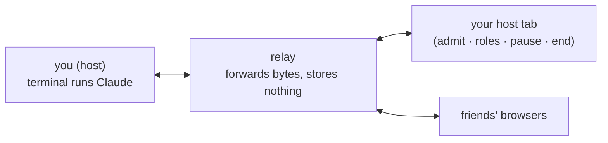

# ✦ claudecollab

**Multiplayer for your Claude Code session.** You run one command. Friends open a link — no install — and drive the same Claude with you: live cursors, shared drafts, a visible queue, roles.

Think **screen-share where they can type too**.

<p align="center"></p>



Your terminal stays plain Claude plus one status line. Everything multiplayer happens in the browser.

## Host a session

```bash
npm install -g @claudecollab/cli
collab
```

That's it. `collab` wraps your normal `claude` and prints your room link on the status line — that's **your** tab (admit people, manage roles). The invite link lands on your clipboard — that's the one you share. Friends need nothing but a browser.

## Two links — don't mix them up

| Link | Who it's for |
|---|---|
| `…/room?host=abc` | **you only** — opening it grants the host seat |
| `…/room` | **share this** — friends land on the request-to-join flow |

The Invite button and your clipboard always hold the safe one.

Want a lock in front of the knock? Host with `collab --room-password <pw>` — guests must enter it before their request ever reaches you. Admitting stays your call either way.

## Roles

| Role | See | Type · answer asks · slash/bash | Admit · kick · pause · end |
|---|---|---|---|
| 👁 viewer | ✅ | ❌ | ❌ |
| ✎ prompter *(default)* | ✅ | ✅ | ❌ |
| ★ host | ✅ | ✅ | ✅ |

## How it feels

- The whole page is the terminal. Type with no draft open → keys go **straight into Claude** — menus, asks, everything.
- **+ draft** (or double-click) opens a floating glass box. Everyone's caret shows; Enter sends; Esc steps out; drag ⠿ to move, ◢ to resize, ✕ to delete.
- Sent while Claude is busy? It waits in the **queue** chip — edit or delete before it fires.
- Scroll the mirror like a real terminal. Scrolling is shared — one screen for everyone.
- Reloaded guests glide straight back in. Kicked guests are out for good.

## The one thing to really understand

A guest prompt **runs on your machine, as you**. Admitting someone = trusting them with your Claude under the current mode. The relay sees your screen — treat a room like a screen-share, not a vault. You have **Pause** and **End** (with an optional `session.md` receipt).

## Self-host the relay

`collab` defaults to the community relay at claudecollab.org. Rather run your own? The same package ships the server:

```bash
collab-relay                              # local: ssh :2222 · web :8787
collab --relay ssh://127.0.0.1:2222       # host through it
```

For a permanent public relay (Fly.io, any VPS — see `fly.toml` in this repo):

```bash
fly launch --no-deploy
fly secrets set HOST_KEY="$(collab-relay --make-key)"
fly secrets set ROOM_SECRET="$(openssl rand -hex 16)"   # optional: gate room creation
fly deploy
```

Two protections are built in:

- **Room secret** — with `ROOM_SECRET` set, only hosts that present it (`CLAUDE_SHARE_SECRET` env or `--secret`) can create rooms. Guests are unaffected — they enter with a room link.
- **Identity pinning** — the CLI pins the relay's ssh key fingerprint on first connect (like ssh's `known_hosts`) and refuses to connect if it ever changes. The relay prints its fingerprint at boot; pin explicitly with `--fingerprint SHA256:…`.

## Flags

| Flag | What it does |
|---|---|
| `--relay <url>` | relay to use (`ssh://host:port`); default is the community relay |
| `--no-relay` | solo mode — no room, no relay, just Claude with the band |
| `--room-password <pw>` | guests must present this before they can knock |
| `--guests <role>` | role given to newly admitted guests (default `prompter`) |
| `--secret <s>` | room-creation credential for a `ROOM_SECRET`-gated relay (or `CLAUDE_SHARE_SECRET` env) |
| `--fingerprint <fp>` | pin the relay's ssh key explicitly (default: trust-on-first-use) |
| `--cmd <program>` | wrap something other than `claude` |
| `-- <args…>` | everything after `--` passes through to the wrapped program |

## Develop

```bash
npm install
npm test           # full suite: protocol, relay, brain, e2e
scripts/rig.sh     # local relay + host wrapping a fake claude (UI work)
```

<details>
<summary>Architecture</summary>

Three packages, plain ESM JavaScript, Node 22, no build step.

```
packages/shared/   protocol.js — host↔relay wire messages
packages/relay/    server.js (ssh door) · web.js (browser door) · public/ (client)
packages/cli/      bin/claude-share.js — the "brain": drafts, queue, roles, gate
test/              end-to-end: host + host tab + guest on localhost
```

- The CLI wraps Claude in a PTY one row short — the bottom row is the status line.
- State (busy/idle/ask) comes from injected Claude Code hooks, never screen-scraping. Ambiguity fails closed.
- The relay stores nothing: kill it and the host reconnects; kill the host and the room is over.

</details>

## License

[MIT](LICENSE). claudecollab is an independent open-source project — not affiliated with or endorsed by Anthropic. *Claude* is a trademark of Anthropic, PBC; this tool wraps the official Claude Code client you already have installed.

**TL;DR:** `npm i -g @claudecollab/cli` → `collab` → share the invite link. Guests need nothing. Roles keep control; prompts are real — admit people you trust.
